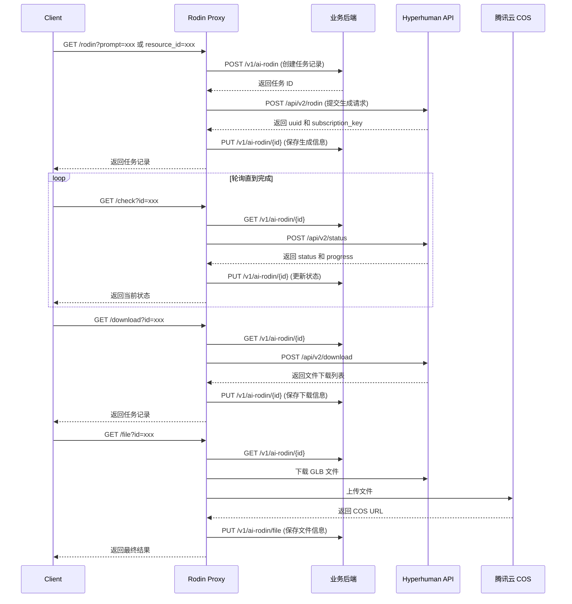

# Rodin AI 3D Model Generation API Proxy

一个用于代理 [Hyperhuman Rodin API](https://hyperhuman.deemos.com/) 的中间层服务，支持通过文本提示或图片生成 3D 模型，并将结果自动上传至腾讯云 COS。

## 📋 项目概述

### 项目目标

本项目是一个 API 代理服务，主要实现以下功能：

1. **封装 Rodin API** - 代理调用 Hyperhuman Rodin API 进行 3D 模型生成
2. **任务状态管理** - 提供任务创建、状态查询、结果下载的完整生命周期管理
3. **云存储集成** - 自动将生成的 GLB 模型文件上传至腾讯云 COS
4. **后端数据同步** - 与业务后端 API 同步任务状态和生成结果

### 技术栈

| 技术                  | 用途               |
| --------------------- | ------------------ |
| **TypeScript**        | 类型安全的开发语言 |
| **Express.js**        | Web 框架           |
| **Zod**               | 请求参数验证       |
| **Axios**             | HTTP 客户端        |
| **Pino**              | 日志记录           |
| **cos-nodejs-sdk-v5** | 腾讯云 COS SDK     |
| **Swagger**           | API 文档生成       |
| **Docker**            | 容器化部署         |

## 🏗️ 项目架构

```
src/
├── index.ts              # 应用入口，Express 配置
├── api.ts                # Rodin API 封装层
├── config.ts             # 配置加载
├── types.ts              # TypeScript 类型定义
├── config/
│   ├── env.schema.ts     # 环境变量验证 Schema
│   └── swagger.ts        # Swagger 配置
├── controllers/
│   └── rodin.controller.ts  # 路由处理器
├── lib/
│   ├── cache.ts          # 缓存服务
│   ├── cos.ts            # 腾讯云 COS 上传
│   └── logger.ts         # 日志服务
├── middlewares/
│   ├── error.middleware.ts    # 错误处理中间件
│   └── validate.middleware.ts # 请求验证中间件
├── schemas/
│   └── rodin.schema.ts   # 请求参数 Zod Schema
└── tests/                # 测试文件
```

## 🔄 工作流程

### 3D 模型生成完整流程



## 📡 API 接口

### GET /rodin

创建或继续 3D 模型生成任务。

**参数：**
| 参数 | 类型 | 必填 | 描述 |
|------|------|------|------|
| `prompt` | string | 条件必填 | 文本提示，用于 text-to-3D |
| `resource_id` | string \| string[] | 条件必填 | 资源 ID，用于 image-to-3D |
| `id` | string | 否 | 已有任务 ID，用于恢复任务 |
| `quality` | string | 否 | 生成质量 |

> **注意：** `prompt` 和 `resource_id` 至少需要提供一个，或者提供 `id` 继续已有任务。

**响应：** 返回创建/更新后的任务记录。

---

### GET /check

查询任务生成状态。

**参数：**
| 参数 | 类型 | 必填 | 描述 |
|------|------|------|------|
| `id` | string | 是 | 任务 ID |

**响应：**

```json
{
  "check": {
    "status": "Completed",
    "progress": 100
  }
}
```

---

### GET /download

获取生成结果的下载链接列表。

**参数：**
| 参数 | 类型 | 必填 | 描述 |
|------|------|------|------|
| `id` | string | 是 | 任务 ID |

**响应：**

```json
{
  "download": {
    "list": [
      { "name": "model.glb", "url": "https://..." },
      { "name": "model.usdz", "url": "https://..." }
    ]
  }
}
```

---

### GET /file

下载 GLB 文件并上传到腾讯云 COS。

**参数：**
| 参数 | 类型 | 必填 | 描述 |
|------|------|------|------|
| `id` | string | 是 | 任务 ID |

**响应：** 返回包含 COS URL 的最终任务记录。

---

### GET /health

健康检查接口。

**响应：**

```json
{
  "status": "ok",
  "timestamp": "2026-01-02T12:00:00.000Z"
}
```

---

### GET /api-docs

Swagger UI 交互式 API 文档。

## 🔧 技术细节

### 安全机制

1. **Helmet** - 设置安全相关的 HTTP 头
2. **Rate Limiting** - 限制请求频率（15分钟内最多100次）
3. **CORS** - 跨域资源共享支持
4. **Zod 验证** - 请求参数强类型验证

### 缓存策略

使用 `node-cache` 进行内存缓存，默认 TTL 为 10 秒，用于缓存 `/check` 接口的响应，减少对 Rodin API 的重复请求。

### 错误处理

统一的错误处理中间件，支持：

- Axios 错误的原始状态码透传
- 详细的错误日志记录
- 友好的错误响应格式

### 日志系统

使用 Pino 进行结构化日志记录：

- JSON 格式输出
- 开发环境使用 pino-pretty 美化
- HTTP 请求自动记录

## 🚀 快速开始

### 环境要求

- Node.js >= 18.0.0
- pnpm (推荐) 或 npm

### 安装依赖

```bash
pnpm install
```

### 配置环境变量

复制 `.env.example` 为 `.env` 并填写配置：

```bash
cp .env.example .env
```

环境变量说明：

| 变量             | 描述                                |
| ---------------- | ----------------------------------- |
| `API_URL`        | 业务后端 API 服务器地址（不含协议） |
| `RODIN_API_KEY`  | Hyperhuman Rodin API 密钥           |
| `COS_SECRET_ID`  | 腾讯云 COS SecretId                 |
| `COS_SECRET_KEY` | 腾讯云 COS SecretKey                |
| `COS_REGION`     | COS 存储桶区域，如 `ap-guangzhou`   |
| `COS_BUCKET`     | COS 存储桶名称                      |

### 开发模式

```bash
pnpm dev
```

服务将运行在 `http://localhost:3000`，支持热重载。

### 生产构建

```bash
pnpm build
pnpm start
```

## 🐳 Docker 部署

### 使用 Docker Compose

```bash
docker-compose up -d
```

服务将映射到主机的 `1981` 端口。

### 手动构建 Docker 镜像

```bash
docker build -t rodin-proxy .
docker run -p 3000:3000 --env-file .env rodin-proxy
```

### Docker 镜像特点

- 多阶段构建，生产镜像精简
- 基于 `node:24-alpine`
- 只包含生产依赖
- 内置健康检查

## 🔄 CI/CD

项目配置了 GitHub Actions 工作流：

### check 作业

- 在 Node.js 18.x、20.x、22.x 上运行
- ESLint 代码检查
- Prettier 格式检查
- TypeScript 类型检查
- 单元测试
- 构建验证

### docker 作业

- 仅在 `main` 分支触发
- 自动构建 Docker 镜像
- 推送到 GitHub Container Registry (ghcr.io)

## 📦 Scripts

| 命令             | 描述               |
| ---------------- | ------------------ |
| `pnpm dev`       | 开发模式（热重载） |
| `pnpm build`     | 编译 TypeScript    |
| `pnpm start`     | 生产模式启动       |
| `pnpm typecheck` | 类型检查           |
| `pnpm lint`      | ESLint 检查        |
| `pnpm format`    | Prettier 格式化    |
| `pnpm test`      | 运行测试           |
| `pnpm clean`     | 清理构建产物       |

## 📄 许可证

ISC
